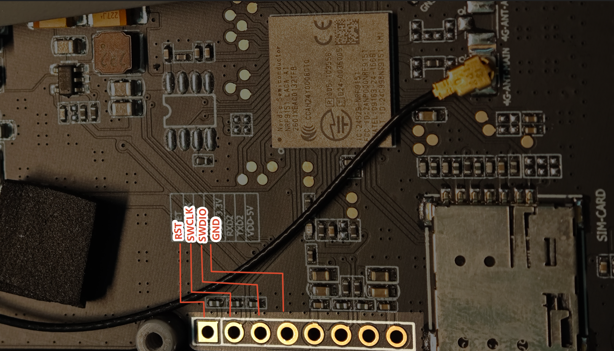

<div align="center" markdown="1">
  
</div>

<h1 align = "center">🌟 T-Display K230 nRF9151 Firmware 🌟</h1>

[English](./README.MD) | [中文](./README_CN.MD)

This repository stores the nRF9151 firmware source code, overlay, patches, and K230-side test scripts currently used by the LILYGO T-Display K230 project.

## Hardware

K230 side:

```text
K230 GPIO2  -> nRF9151 enable / power control, high enables nRF9151, low disables nRF9151
K230 GPIO28 -> nRF9151 UART1 RX, P0.26
K230 GPIO29 <- nRF9151 UART1 TX, P0.27
```

nRF9151 side:

```text
UART1 TX1 = P0.27, AT response to K230
UART1 RX1 = P0.26, AT command from K230
UART2 TX2 = P0.29, debug log output
UART2 RX2 = P0.28, debug log input, currently optional
LED       = P0.23
Baud      = 115200 8N1
Flow ctrl = disabled, no RTS/CTS
```

K230 BSP integration is recorded in:

```text
bsp-patches/0061-riscv-dts-rm69a10-enable-uart3-nrf9151.patch
```

That patch enables `/dev/ttyS3` for GPIO28/GPIO29 and configures GPIO2 as the
userspace modem enable pin.

## Firmware Options

Two firmware profiles are kept:

```text
serial_modem_k230/     Recommended Nordic Serial LTE Modem adaptation
at_client_k230/        Low-level AT Client bring-up firmware
```

Use `serial_modem_k230` for the K230 phone UI Cellular app. It provides LTE,
SIM, GNSS, NMEA, and LED-control behavior expected by the UI.

Use `at_client_k230` only when you need the simplest modem AT passthrough for
hardware bring-up.

## AT Command Guide

- [K230 nRF9151 AT command guide](docs/AT_COMMANDS.md)
- Official nRF91 AT Commands Reference Guide v0.7.1:
  <https://www.nordicsemi.com/-/media/Restricted/ProductKeys/L984675KPNS/nrf91atcommandsv071.pdf>

## Prerequisites

Install Nordic nrfutil first,[Click here download nRFUtil](https://www.nordicsemi.com/Products/Development-tools/nRF-Util).

```sh
# Install nrfutil by following Nordic's official instructions.
nrfutil install sdk-manager
```

Install NCS v3.4.0 under this repository. The build scripts default to this
repository-relative path:

```text
./ncs/v3.4.0
```

```sh
nrfutil sdk-manager install --install-dir "$PWD/ncs" v3.4.0
```

If NCS is already installed somewhere else, override `NCS_ROOT`:

```sh
export NCS_ROOT=/path/to/ncs/v3.4.0
```

Nordic Serial LTE Modem is tracked as a git submodule so every build uses a
known source revision:

```text
third_party/ncs-serial-modem
commit 13c80da97fe4d55ecb5a9745834d97be22821307
```

Clone this repository with submodules:

```sh
git clone --recurse-submodules https://github.com/Xinyuan-LilyGO/T-Display-K230-nRF9151 t-display-k230-nrf9151
cd t-display-k230-nrf9151
```

If the repository was cloned without submodules:

```sh
git submodule update --init --recursive
```

## Build Serial LTE Modem

```sh
cd t-display-k230-nrf9151
./build_serial_modem.sh
```

Default output:

```text
build/serial_modem_k230/zephyr/tfm_merged.hex
```

If the upstream build layout changes, locate outputs with:

```sh
find build/serial_modem_k230 -path '*/zephyr/tfm_merged.hex' -o -path '*/zephyr/zephyr.hex' -o -path '*/zephyr/zephyr.elf'
```

The K230 profile applies these patches to the upstream Serial LTE Modem source:

```text
serial_modem_k230/patches/0001-k230-gnss-nmea-urc-and-led.patch
serial_modem_k230/patches/0002-k230-optional-xdfu.patch
serial_modem_k230/patches/0003-k230-uart-diag.patch
serial_modem_k230/patches/0004-k230-gnss-nmea-urc-worker.patch
serial_modem_k230/patches/0005-k230-led-at-control.patch
```

Important behavior:

- UART1 is the K230 AT command link.
- UART2 is the debug log console.
- P0.23 is on by default and can be controlled by AT command.
- GNSS fix changes the LED to a one-second cadence with about 300 ms on time.
- `AT#XNMEA=0|1` enables or disables NMEA URCs on the AT UART.
- `AT+CFUN=1` is required before SIM detection commands such as `AT+CPIN?`.
- `tfm_merged.hex` contains TF-M plus the non-secure application. It does not
  update the cellular modem firmware package `mfw_nrf91x1_*.zip`.

## Build AT Client

```sh
cd t-display-k230-nrf9151
./build_at_client.sh
```

Default output:

```text
build/at_client_k230_dual_uart/at_client_k230/zephyr/tfm_merged.hex
```

## Flash

> [!IMPORTANT]
>
> 1. ⚠ Maintain the connection to the K230 host during flashing; GPIO2 on the K230 side must be set to a high level.
> 2. ⚠ Connect only the **SWDIO**, **SWCLK**, and **GND** pins during flashing; do not connect the **3.3V** pin.
> 3. ⚠ Flashing can be performed regardless of whether a SIM card is inserted; the process is independent of the SIM card.
>


- Flash the generated `tfm_merged.hex` using nRF Connect Programmer, **J-Link**, or **DAPLink/CMSIS-DAP**. If using **nRF Connect Programmer**, **J-Link** must be used for programming.
- For the **DAPLink/CMSIS-DAP** route, [docs/FLASH_PYOCD.MD](docs/FLASH_PYOCD.MD) gives a complete pyOCD procedure — wiring, flash commands and verification. No J-Link is required, and the host may be x86_64 or arm64.
- During programming, K230 GPIO2 must be set to high level on the K230 side before powering on the nRF9151.
- The programming interface, **SWD**, can only be accessed by opening the keyboard panel. Connect only **SWDIO**, **SWCLK**, and **GND** pins during programming. Do not connect a 3V3 power supply to J-Link or other programmers.
- The programming interface is shown in the image below.

  

- nRF Connect Programmer flashing demonstration (Note: The step in the video involving writing **mfw_nrf91x1_2.0.4.zip** is not required unless the device has been fully erased or the LTE firmware package has been overwritten by another firmware package.)

  <video src="https://github.com/user-attachments/assets/668f1def-420b-4c83-ae40-9d57c0a985e4" controls width="100%"></video>

## K230 Runtime Test

After flashing and powering the nRF9151:

- P0.23 should indicate firmware state.
- K230 should see the module on `/dev/ttyS3`.
- Serial settings are `115200 8N1`, no hardware flow control.

Interactive console:

```sh
scp k230_nrf9151_at_console.sh root@<k230-ip>:/root/
ssh root@<k230-ip>
TTY=/dev/ttyS3 /root/k230_nrf9151_at_console.sh
```

Basic SIM/LTE smoke test:

```text
AT
AT+CMEE=1
AT+CFUN=1
AT%XSIM?
AT+CPIN?
AT+CIMI
AT+CGMR
```

Expected SIM-present result:

```text
%XSIM: 1
+CPIN: READY
```

GNSS/NMEA smoke test:

```text
AT#XNMEA=1
AT%XSYSTEMMODE=0,0,1,0
AT+CFUN=31
AT#XGNSS=1,0,0,0
```

## Repository Layout

```text
at_client_k230/                 K230 AT Client Zephyr app
serial_modem_k230/              K230 Serial LTE Modem profile and patches
third_party/ncs-serial-modem/   Nordic Serial LTE Modem upstream submodule
bsp-patches/                    K230 Linux SDK device-tree patch for UART3/GPIO2
build_at_client.sh              One-command AT Client build helper
build_serial_modem.sh           One-command Serial LTE Modem build helper
k230_at_probe.sh                K230-side automated AT probe helper
k230_nrf9151_at_console.sh      K230-side interactive AT console
k230_dual_uart_pins.overlay     nRF9151 UART1/UART2/LED overlay
```

## Known Notes

- `mfw_nrf91x1_*.zip` is Nordic modem firmware. It is separate from
  `tfm_merged.hex`; update it with Nordic tooling when required. pyOCD can also
  write it over a CMSIS-DAP probe (`nrf91-update-modem-fw`), so a J-Link is not
  required for this either — see [docs/FLASH_PYOCD.MD](docs/FLASH_PYOCD.MD).
- Erasing with `--chip` (application core only) leaves the modem firmware in
  place, so a modem rewrite is normally unnecessary. A `recover`/mass erase is
  what makes one necessary.
- The default factory firmware includes **[mfw_nrf91x1_2.0.4.zip](https://nsscprodmedia.blob.core.windows.net/prod/software-and-other-downloads/sip/nrf91x1-sip/nrf91x1-lte-modem-firmware/mfw_nrf91x1_2.0.4.zip)**.
- Hardware flow control must remain disabled because the K230 board only wires
  TX/RX for this link.
- GPIO2 is controlled by the K230 application and scripts. Do not toggle it
  while debugging GNSS unless you intentionally want to power-cycle the module.


## Differences Among nRF9151 / nRF91x1 Firmware: NTN, LTE, and DECT NR+

The core difference among these three firmware variants lies in the **communication network** and **functionality** they support. In short, they are designed for **satellite**, **terrestrial cellular**, and **DECT NR+ local** networks, respectively.

---

## Comparison Table

| Feature                | **NTN Firmware**                                                               | **LTE Firmware**                                                | **DECT NR+ Firmware**                                         |
| :--------------------- | :----------------------------------------------------------------------------- | :-------------------------------------------------------------- | :------------------------------------------------------------ |
| **Firmware file name** | `mfw_nrf9151-ntn`                                                              | `mfw_nrf91x1`                                                   | `mfw-nr+_nrf91x1`                                             |
| **Core network**       | **Non‑Terrestrial Networks (NTN)** – satellite communication                   | **Terrestrial cellular** (LTE‑M / NB‑IoT)                       | **DECT NR+** (a non‑cellular local wireless technology)       |
| **Primary function**   | Enables **NB‑IoT NTN** (3GPP Rel‑17) direct‑to‑satellite connectivity          | Standard LTE‑M/NB‑IoT cellular data connection                  | Dedicated DECT NR+ PHY‑layer communication                    |
| **GNSS (GPS)**         | **Supported**                                                                  | **Supported**                                                   | **Not supported**                                             |
| **Cellular (LTE)**     | **Supported** (as a fallback/complement)                                       | **Supported** (core function)                                   | **Not supported**                                             |
| **DECT NR+**           | **Not supported**                                                              | **Not supported**                                               | **Supported** (core function)                                 |
| **Socket support**     | **Supported**                                                                  | **Supported**                                                   | **Not supported**                                             |
| **Primary use case**   | IoT applications in oceans, deserts, remote areas without terrestrial coverage | Conventional cellular IoT (smart cities, industrial monitoring) | Large‑scale, long‑range, high‑reliability local mesh networks |
| **Availability**       | Free download from Nordic website (Alpha version)                              | Free download from Nordic website                               | Contact Nordic sales for access                               |


## Key Points and Detailed Differences

- **Mutually exclusive – cannot be used simultaneously**  
  Although the nRF9151 modem hardware is capable, it can run **only one firmware at a time**. This means you cannot use LTE and DECT NR+ together, nor NTN and DECT NR+ simultaneously.

- **DECT NR+ is a “dedicated” mode**  
  Choosing the DECT NR+ firmware effectively turns the nRF9151 into a **dedicated DECT NR+ radio**, **completely abandoning** cellular and GPS/GNSS functionality.

- **NTN is an “enhanced” version of LTE**  
  The `mfw_nrf9151-ntn` firmware can be seen as a **special variant** of the standard LTE firmware. It retains terrestrial LTE and GNSS capabilities while adding the extra “superpower” of satellite connectivity.


## How to Choose

- **Choose NTN firmware** if your device must operate in **oceans, deserts, remote mountains**, or anywhere without terrestrial cellular coverage.
- **Choose LTE firmware** – this is the **most common** choice – if your device runs in urban, suburban, or rural areas with normal cellular network coverage.
- **Choose DECT NR+ firmware** if you want to build a **private, large‑scale local network** (e.g., smart streetlights, industrial sensor networks) using DECT NR+ technology, and you do **not** need cellular or GPS functions.


> [!IMPORTANT]
> 
> ⚠ The default firmware written at the factory is LTE firmware.
>
